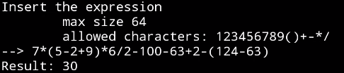

# ARM Calculator

This is a calculator implemented in ARMv8 assembly for the computational part, and in C for the input/output (IO). It is capable of evaluating expressions with the four basic operations (+, -, *, /) and parentheses to determine calculation priorities.

(note that the division is iteger division)

## Explanation

### Code in C

The C code is responsible for taking the expression string from the user input. Once the string is obtained, the method https://github.com/Gabritorre/ARM-calculator/blob/dede72521675ecd4a3650d0a18874e35776dc446/main.c#L12 is called to check if all the characters used in the expression are valid.

If the expression is valid, it is then passed to the ARM code. The ARM code first converts the string from infix notation to [RPN](https://en.wikipedia.org/wiki/Reverse_Polish_notation), making it easier to calculate.

Afterwards, the ARM method is called to calculate the result from the RPN expression.

Finally, the result is printed out.

### RPN_converter.s

This code creates a new string in Reverse Polish Notation (RPN) from the input string. The process involves scanning the characters of the input string and following the algorithm outlined below:

1. If the character is a number, it is appended to the output string.
2. If the character is an open bracket, it is pushed onto the stack.
3. If the character is a close bracket, the elements inside the stack are popped and appended to the output string until an open bracket is encountered.
4. If the character is an operator:
   - If the stack is empty, the operator is pushed onto the stack.
   - If the character has higher priority compared to the operator at the top of the stack, the character is pushed onto the stack.
   - Otherwise (if the character has lower or equal priority compared to the top of the stack), elements are popped from the stack and appended to the output string until a lower priority operator is found at the top of the stack or until the stack is empty. After the loop terminates, the character is pushed onto the stack.
5. When the input string ends, all the elements remaining in the stack are popped and appended to the output string.

The character `'\n'` is used to indicate the end of the expression.

The character `<space>` is used to indicate the end of a number.

### compute.s

This code evaluates the expression by taking the input in Reverse Polish Notation (RPN). The algorithm works as follows:

Obtain a character, and if it is:
- A number, continue scanning the string until a space is found. Using a stack and a multiplier factor, convert the string into a real number, and push it onto the stack.
- An operator, pop two elements from the stack, perform the corresponding operation, and push the result back onto the stack.
Repeat this process until the character `'\n'` (end of the string) is encountered.
